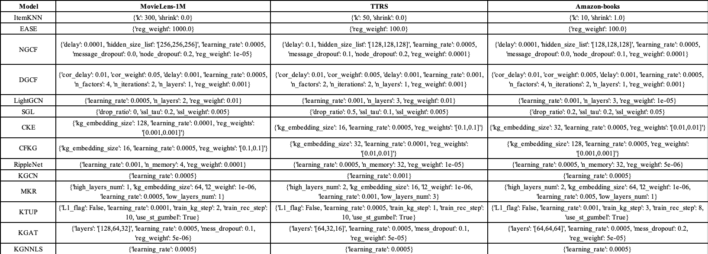

# kg_based_recsys_eval

`pip install -r requirements.txt`

# Prepare TTRS dataset

`python3.7 run_ttr_dataset.py`

# Hypertuning  
Only amazon-books dataset requires filtering

`python3.8 run_hyper.py --model=CKE --dataset=amazon-books --params_file=hypertests/CKE_hyper.test --topk=[1,5,10,15,20] --user_inter_num_interval=[30,inf\) --item_inter_num_interval=[30,inf\) --output_file=../CKE_hyper_amazon-books.result`

optimal hyperparams:

# Run resulting model

`python3.8 run_recbole.py --model=CKE --dataset=ml-1m --topk=10 --learning_rate=0.0001 --kg_embedding_size=16 --reg_weights=[0.01,0.01]`

# Parse logs & Plot graphs

parse_logs_graphs.ipynb
